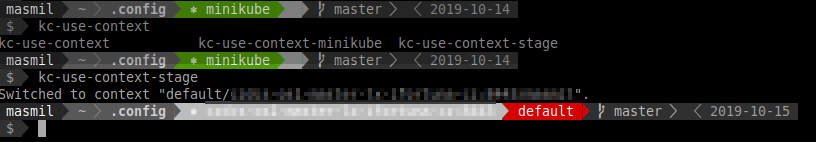

# Userspace .config directory of various tools

## Powerline prompt for bash
Features:
- Command line prompt on multiple lines (two in my case). You can change at [./powerline/themes/shell/default_multiline.json](./powerline/themes/shell/default_multiline.json)
- Shows
   - Kubernetes context (thanks to Powerkube project Powerline plugin). Manage Normal/Warn/Alert colors for Kubernetes context - cluster/namespace at [./powerline/colorschemes/shell/default.json](./powerline/colorschemes/shell/default.json).
   - git branch

Example:



### Installation

With [Mint 19.2](https://www.linuxmint.com/start/tina/) you may install Powerline using pip.

Install Pip.
```
$ sudo apt install python-pip
```
Deploy Powerline and Powerkube
```
$ pip install powerline-status powerkube

$ pip list | grep power
powerkube (0.1.3)
powerline-status (2.7)
```

You may have to fix Powerkube following this PR (https://github.com/zcmarine/powerkube/pull/3/files).

Finally, get this repo.

```
cd ~
git clone https://github.com/MilanMasek/.config.git
```
